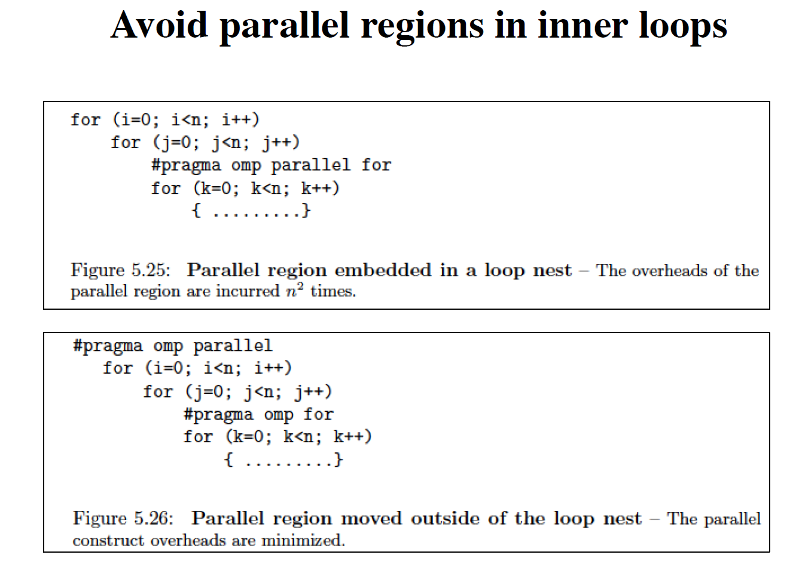
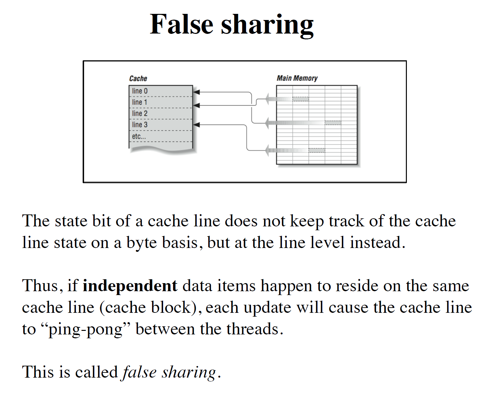

# 目录

[toc]

# How to Get Good Performance by Using OpenMP!

## 一、单个线程可以做到的优化

### 1. 数组的每一行是连续的地址空间——能够被装入缓存块，列不行

### 2. loop unrolling

- 这个可以配合INTEL SIMD使用

### 3. loop fusion 循环合并

- 循环访问同一个数组时，将所有操作都集中在这次循环中——利用缓存

### 4. loop fission 循环拆分

将独立的计算从原有的循环中分离——利用缓存

### 5. loop tiling将嵌套循环分为小部分来做

- 这个例子演示了快速的矩阵转置方法

## 二、使用多线程优化

### 1.测量优化的效果

- 使用Linux的`time`指令
- 使用`omp_get_wtime()`函数

### 2. parallel overhead：为了协调多线程而花费的时间（负作用）

时间单位都是微秒，即$10^{-6}$秒，影响不太大

#### (a) 尽量不要使用同步机制

- 比如critical region

#### (b) maximize parallel region

- 看右上角的小图，每一次fork（启动并行区域）都会花费时间，且每一次都需要保证所有线程运行完毕才能结束
- 应该这样：

#### (c)内层循环不应该开启parallel region

### 3. load balance：平衡每个线程的工作量

- 避免忙的忙死，闲的闲死

例子：

### 4.false sharing：多个线程频繁修改缓存区

例子：

